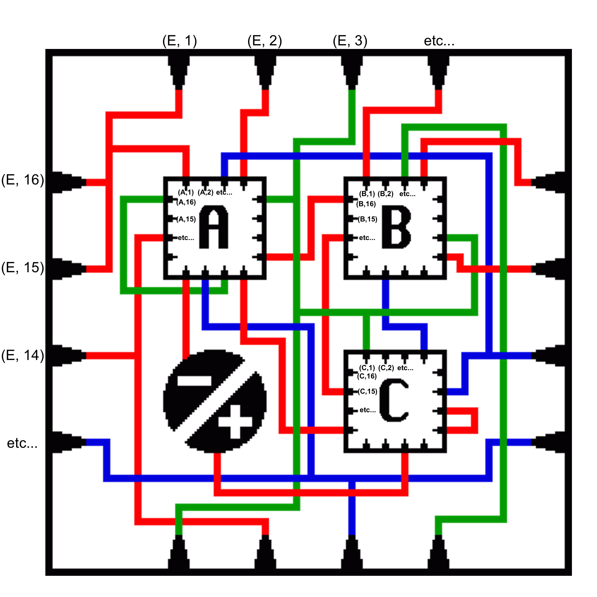

# Recursive Maze Solver

This is small piece of code I wrote to generate a solver for the puzzle found at the bottom of [this webpage](http://www.cis.upenn.edu/~cis39903/). Though this is solvable by hand, the recursive nature of it led me to decide that a programming solution would be the best if I wanted to guarantee my solution was error free (since keeping track of all of the layers of recursion can be extra tricky.) 

My solution essentially just performs BFS on states representing different nodes / locations within the puzzle. These nodes are described by a list of recursive layers (describing whether the nodes refer to points on the outer graph, or within the A box, or within the B box within the A box, etc.) and the point itself in that layer. That point is a number 1-16 referring to the 16 points around each "box" (1 is the top left, and they follow clockwise), along with a letter 'A', 'B', 'C', or 'E' referring to whether the point outside of box A, B, C, or is on the outer Edge.



Hence, the following solution is output by my code:

```python
PuzzleState([], ('C', 10))
PuzzleState(['C'], ('E', 10))
PuzzleState(['C'], ('A', 11))
PuzzleState(['C', 'A'], ('E', 11))
PuzzleState(['C', 'A'], ('A', 14))
PuzzleState(['C', 'A', 'A'], ('E', 14))
PuzzleState(['C', 'A', 'A'], ('E', 11))
PuzzleState(['C', 'A'], ('A', 11))
PuzzleState(['C', 'A'], ('E', 8))
PuzzleState(['C'], ('A', 8))
PuzzleState(['C'], ('B', 16))
PuzzleState(['C', 'B'], ('E', 16))
PuzzleState(['C', 'B'], ('A', 1))
PuzzleState(['C', 'B', 'A'], ('E', 1))
PuzzleState(['C', 'B', 'A'], ('E', 16))
PuzzleState(['C', 'B'], ('A', 16))
PuzzleState(['C', 'B'], ('A', 10))
PuzzleState(['C', 'B', 'A'], ('E', 10))
PuzzleState(['C', 'B', 'A'], ('A', 11))
PuzzleState(['C', 'B', 'A', 'A'], ('E', 11))
PuzzleState(['C', 'B', 'A', 'A'], ('E', 14))
PuzzleState(['C', 'B', 'A'], ('A', 14))
PuzzleState(['C', 'B', 'A'], ('E', 11))
PuzzleState(['C', 'B'], ('A', 11))
PuzzleState(['C', 'B'], ('E', 8))
PuzzleState(['C'], ('B', 8))
PuzzleState(['C'], ('E', 6))
PuzzleState([], ('C', 6))
PuzzleState([], ('A', 3))
PuzzleState(['A'], ('E', 3))
PuzzleState(['A'], ('E', 12))
PuzzleState([], ('A', 12))
```

So from the "+" sign, we follow the red line to the point outside of the C box, then we enter it (so now we are on the outer edge of the inside of C). From there, we follow the blue line from ('E', 10) to ('A', 11) (a point right below A). The path continues and continues, eventually recursing in and out of different layers, until we get to the red line under A which is connected to the "-" sign. And we're done!
